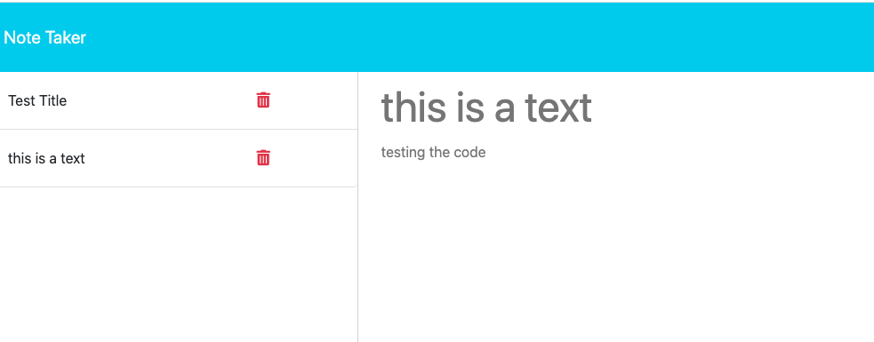
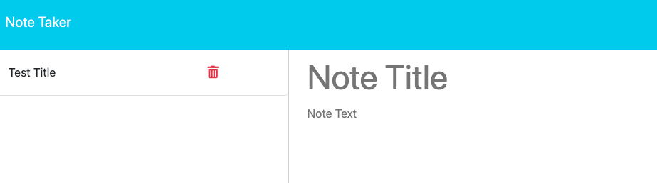

# Express.jS notetaker refactor
  
  
## [License](#license)

No license was used for this project.

  ## [Description](#table-of-contents)
  
  With this application, you can keep track of notes for personal or business use. Adding and deleting them as necessary
  
  
  ## Table of Contents
  
  - [Description](#discription)
  - [Installation](#installation)
  - [Usage](#usage)
  - [Credits](#credits)
  
  - [Tests](#tests)
  - [License](#license)
  - [Questions](#questions)
  
  ## [Installation](#table-of-contents)
  
  No Installation is needed, simply launch the Heroku link
    
  ## [Usage](#table-of-contents)
  
  Click [Here](https://young-waters-60756.herokuapp.com/) for the Heroku link and upon visiting the site, you are greeted with the homepage and after clicking the `Get Started` button the page will refresh with the notes area. Simply click on the note to text area and fill out the title and contents and you will see a 💾 so save the note. And to it's a note just simply click on the trashcan 🗑 icon

  
  ## [credits](#table-of-contents)
  
  N/A

  Thank you for your interest in helping out; however, I will not be accepting contributions from third parties.
  

  

  ## [Tests](#table-of-contents)

  You can run the app with the test instructions above and you can also open up the markdown editor of your choice to watch the notes in the db.db.json update and get deleted and update in real time

  ## [Questions](#table-of-contents)

  Please contact me using the following links:
  [GitHub](https://github.com/philippwinston)
  [Email: philippwinston@gmail.com](mailto:philippwinston@gmail.com)
  
---
